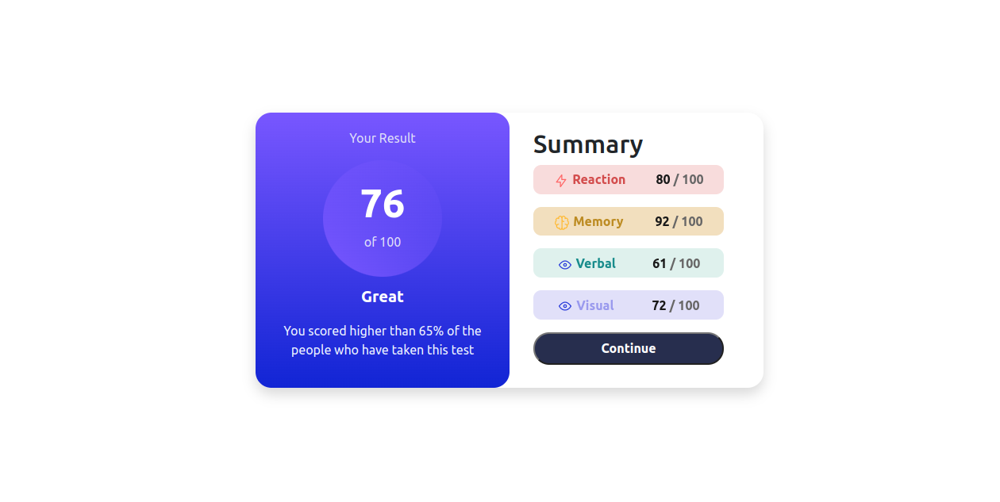

# Frontend Mentor - Results summary component solution

This is a solution to the [Results summary component challenge on Frontend Mentor](https://www.frontendmentor.io/challenges/results-summary-component-CE_K6s0maV). Frontend Mentor challenges help you improve your coding skills by building realistic projects. 

## Table of contents

- [Overview](#overview)
  - [Screenshot](#screenshot)
  - [Links](#links)
  - [Built with](#built-with)
  - [What I learned](#what-i-learned)
- [Author](#author)

## Overview

### Screenshot

### Links

- Solution URL: [Solution](https://github.com/wisdom209/FrontendMentor/tree/main/results_summary_component)
- Live Site URL: [Live site](https://frontend-mentor-1fdk.vercel.app/results_summary_component/index.html)

### Built with

- Semantic HTML5 markup
- CSS custom properties
- Flexbox
- Mobile-first workflow

### What I learned

- Media Queries and custom break points

## Author
- Frontend Mentor - [@wisdom209](https://www.frontendmentor.io/profile/wisdom209)
- Twitter - [@wisdom209](https://www.twitter.com/wisdom209)
